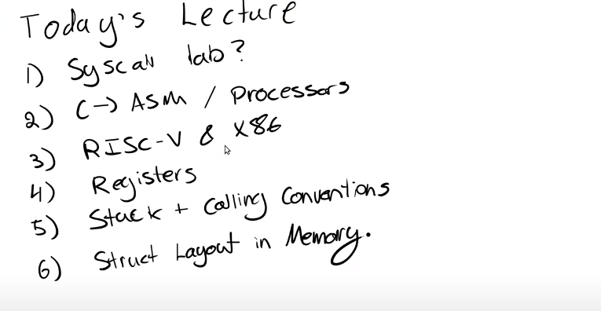

# 5.1 C程序到汇编程序的转换

（00:00 - 05:25 在讨论syscall lab，没有什么实质内容故跳过）

今天的课程，我们会稍微讨论C语言转换到汇编语言的过程，以及处理器相关的内容。今天的课程更多偏向的是实际应用，或者至少我们的目标是这样。所以这节课的目标是让你们熟悉RISC-V处理器，汇编语言，以及RISC-V的calling convention。对于page table来说这些内容不太重要，但是对于这周要发布的traps lab来说，这些内容至关重要，因为在这个实验中你们将会频繁用到trapframe（注，XV6中用来实现trap的一个内存page，lecture 6有详细内容）和栈。这些就是今天这节课的主要内容。

我们首先来简单看一下C语言是如何转换成汇编语言的。这部分内容有点像是对你们之前学过的6.004或者任意其他计算机架构课程的简单回顾。

通常来说，我们的C语言程序会有一个main函数，假设在这个函数内你执行了一些打印然后退出了。

.png>)

目前看起来都还不错。但是如果你学过了6.004的话，你应该知道，处理器并不能理解C语言。处理器能够理解的是汇编语言，或者更具体的说，处理器能够理解的是二进制编码之后的汇编代码。

在下面这张图中，我从一个SiFive（注，一家基于RISC-V处理器的厂商）主板上圈出了一个实际的RISC-V处理器。

.png>)

当我们说到一个RISC-V处理器时，意味着这个处理器能够理解RISC-V的指令集。所以，任何一个处理器都有一个关联的ISA（Instruction Sets Architecture），ISA就是处理器能够理解的指令集。每一条指令都有一个对应的二进制编码或者一个Opcode。当处理器在运行时，如果看见了这些编码，那么处理器就知道该做什么样的操作。上图中的处理器正好能理解RISC-V汇编语言。

所以通常来说，要让C语言能够运行在你的处理器之上。我们首先要写出C程序，之后这个C程序需要被编译成汇编语言。这个过程中有一些链接和其他的步骤，但是因为这门课不是一个编译器的课程，所以我们忽略这些步骤。之后汇编语言会被翻译成二进制文件也就是.obj或者.o文件。

.png>)

如果你们曾经注意过你们的lab目录，在运行完_make  qemu_之后你会看到一些.o文件，这些就是处理器能够理解的文件。虽然你还没有写任何汇编程序，你们也可以在目录中看到一些.asm文件，这是由C语言编译生成的。如果你们学过了6.004，那么你们必然已经看过一些汇编语言。

汇编语言不具备C语言的组织结构，在汇编语言中你只能看到一行行的指令，比如add，mult等等。汇编语言中没有很好的控制流程，没有循环（注，但是有基于lable的跳转），虽然有函数但是与你们知道的C语言函数不太一样，汇编语言中的函数是以label的形式存在而不是真正的函数定义。汇编语言是一门非常底层的语言，许多其他语言，比如C++，都会编译成汇编语言。运行任何编译型语言之前都需要先生成汇编语言。

以上就是让计算机能够理解我们的C代码的基本流程。
