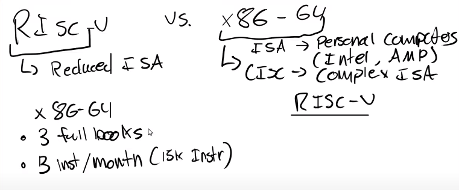
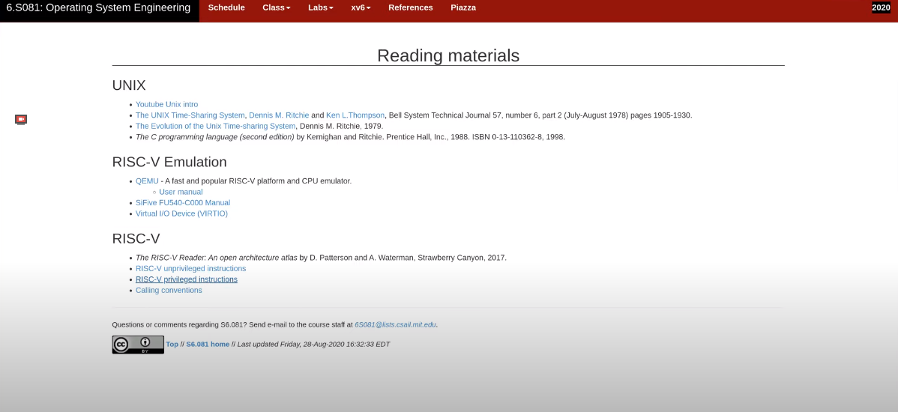
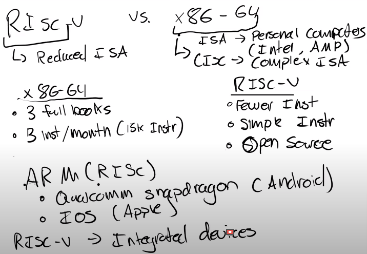

# 5.3 RISC-V和X86

你可能注意到了，在课程中我们一直都有提到RISC-V汇编以及RISC-V处理器。这很重要，因为汇编语言的种类有很多，所以对于你们个人来说，你们是不太可能用到RISC-V的，你们不太可能会在RISC-V处理器上运行Linux。

事实上绝大多数现代计算机都运行在x86处理器上（有时候你们看到的是x86-64）。这是一个不同于RISC-V的指令集架构，它看起来和RISC-V十分相似，但这才是你们自己的个人电脑上最常见到的指令集（如果你们用intel的话）。intel的cpu实现了x86指令集，amd的cpu也实现了x86指令集。

x86与RISC-V并没有它们乍一看起来那么相似，它们之间的区别相对来说还比较重要。RISC-V中的RISC表示精简指令集（Reduced Instruction Set）。x86-64则被称为CISC，或者说是复杂指令集。在它们之间有一系列的差别，其中一点就是x86-64中指令的数量与RISC-V对比非常之多。Intel的手册中指令数量过多是创造RISC-V的一个主要动机。x86-64的参考手册是三本厚书，那里面包含了整个x86-64指令集。有统计资料表明，自x86-64于70年代发布以来，intel一直以每月3条指令的速度向x86-64指令集中添加指令。我估计x86-64指令集大概有15000条指令。而另一方面，就RISC-V来讲，仅仅两份文档就涵盖了RISC-V指令的所有内容。

在这门课程中，我们并不期望你们能记住每一条RISC-V指令。但如果你对这些指令感兴趣的话，或者对某个指令感到迷惑，你可以到课程网站上：

在references标签下可以看到我们在RISC-V段落下放了几个链接，包括了特殊权限指令（只能在kernel mode执行的指令）的链接和普通权限指令（user mode可以执行的指令）的链接。这些文档可以给你提供一系列关于指令集架构的信息，不过请注意这个文档是240页，而另一个文档是135页。比起x86-64指令集的手册，这两份文档明显小很多。

RISC-V的这个特点非常棒，在RISC-V中，有比x86更少的指令，这些指令也更简单。我之所以这么说是因为x86-64中的指令实在太多了，x86-64中大量的指令集完成不止一件任务，它们执行了一系列复杂的操作并给出结果，而在RISC-V中就不是这样，RISC-V指令倾向于拥有更少的职责，所以运行每条指令消耗的CPU cycle也比x86-64更少。

x86-64和RISC-V的差别只是设计师所做出的一种权衡。事实上并没有真正意义上的精简指令集或是复杂指令集哪个更好的说法，两种指令集都有它们各自的用途。RISC-V还有一个很酷的优点，与x86不同的是，RISC-V是开源的，它是市面上仅有的开源指令集之一，所以这意味着任何人都能用RISC-V开发处理器。

RISC诞生于uc berkeley的一个项目，uc berkeley是其发源地。从那时起就有许多公司使用并赞助RISC-V，你可以在网上找到名单。我记得最近SiFive（大概是RISC-V处理器的主板制造商）发布了一则公告宣称他们将发布用于个人PC的RISC-V主板，那是一个为个人PC设计的RISC-V处理器。如果你们上完6.s081之后想用一用RISC-V，到时候就有一个能让你们在自己的电脑上运行Linux的RISC-V处理器了。

在你们的日常生活中，你们可能在没有意识到的情况下已经使用了精简指令集，比如arm汇编，arm也是一个精简指令集，高通的骁龙系列处理器就是arm架构的处理器。所以如果你有一个安卓手机，你很有可能在使用精简指令集。即使你用的是iOS也一样，苹果公司也在它们的处理器中使用了某些版本的arm架构。iPad，iPhone以及大多数苹果设备都运行在那个处理器上，精简指令集可谓到处都是。如果你想在现实中而非qemu中找到RISC-V来使用，你可以在诸如嵌入式设备（intergrated devices）这样的设备上找到它，它并不像x86-64那样随处可见。但是我记得这两年苹果正在将macs（指mac系列PC）迁移到arm架构，可以肯定地说，因为有intel笨重的CPU的前车之鉴，苹果正朝着精简指令集发展。

intel指令集架构如此庞大的根源在于他们非常关心向后兼容性，因此即使是三四十年前的intel代码也可以在现代intel处理器上运行。intel并没有删除任何指令，所以他们的cpu可以保持向后兼容性。而RISC-V则更为现代化，所以不用担心RISC-V会存在这些历史遗留问题。

（瞎扯中）如果处理器有15000条指令，我们几乎不可能有效地在流水线上传送指令（pipeline them）。我们为啥需要这么多？我的意思是这么多指令只是为了向后兼容性，是否使用完全取决于你自己是否觉得向后兼容性重要。绝大多数都是cmd使用的专属的一类特殊指令，你不可能会用上这些指令，我从来没见过谁能完全利用15000条intel指令。这些指令中绝大多数的诞生都是为了满足向后兼容性的需求以及cmd的需求。

让我们回到这些手册。这个基整数指令集包含了所有正常的像add，multiply之类的指令。

然后处理器可以选择性地实现一些其他模块，你可以在这边看到这些模块，比如如果你想要一个支持单精度浮点数的标准扩展的处理器你可以导入f模块。。

这使得RISC-V更容易支持向后兼容性，因为你知道你导入并支持了哪些模块，然后编译器可以做出选择，编译器会说：“好的，这个处理器告诉我，它支持这些模块，所以我只可以用这些模块来编译这些代码。”

有学生说看起来用x86处理器代替RISC-V处理器的唯一优势就是你可以获得性能提升，然而这些性能提升带来了大量的代价与复杂性以及潜在安全问题。那么为什么我们仍然在用x86而非迁移到其他处理器架构（比如RISC-V），主要原因是整个世界一直在使用x86，如果突然地开始把所有处理器都换成RISC-V，这会带来很大的风险，这会使得很多重要的设备失去支持。

不过intel也在他们的CPU里添加了一些有意思的功能，比如安全方面实现了可由代码定义的内存私有区域（enclaves），又比如intel实现的一些高度特殊的指令在进行特定运算时非常高效。在许多种不同场景下，intel的CPU都有一个完美的指令能够以远超RISC-V的效率完成任务。一个更实际的答案是，RISC-V确实过于年轻且此前没有人为个人PC实现RISC-V处理器，而SiFive直到近期才宣布公告，他们是第一批想要做个人PC的RISC-V处理器的，所以在现实层面上，他们的RISC-V处理器不可能运行所有为intel处理器设计的软件。

