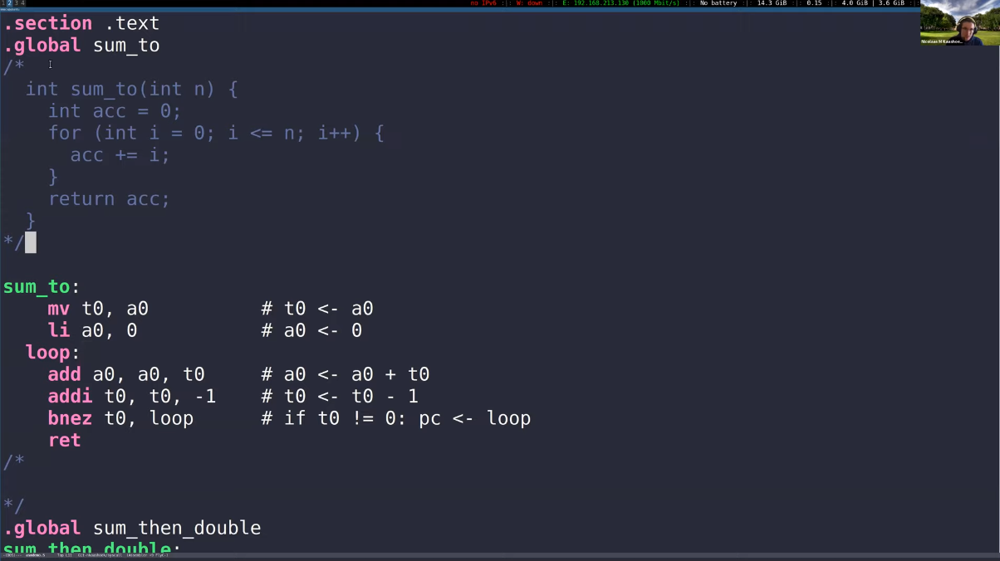
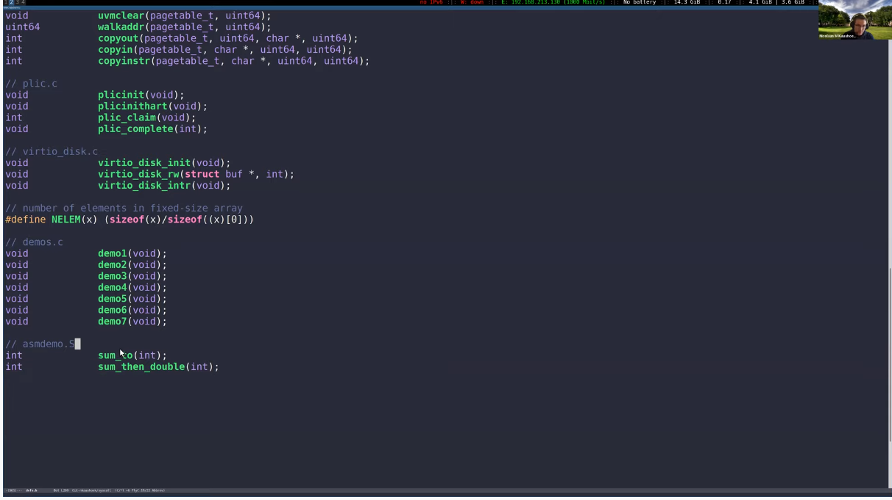
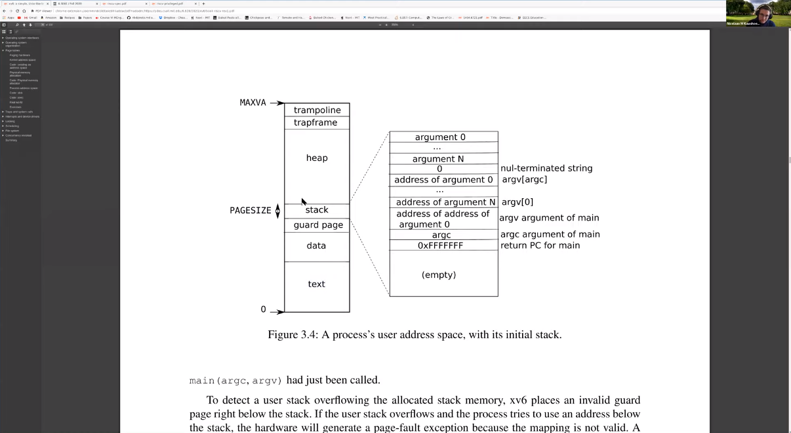
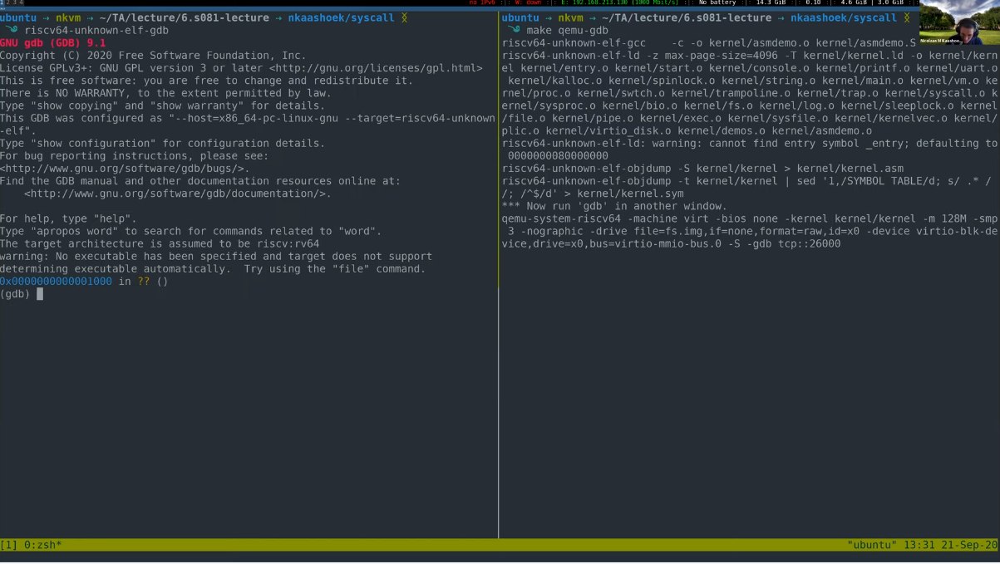
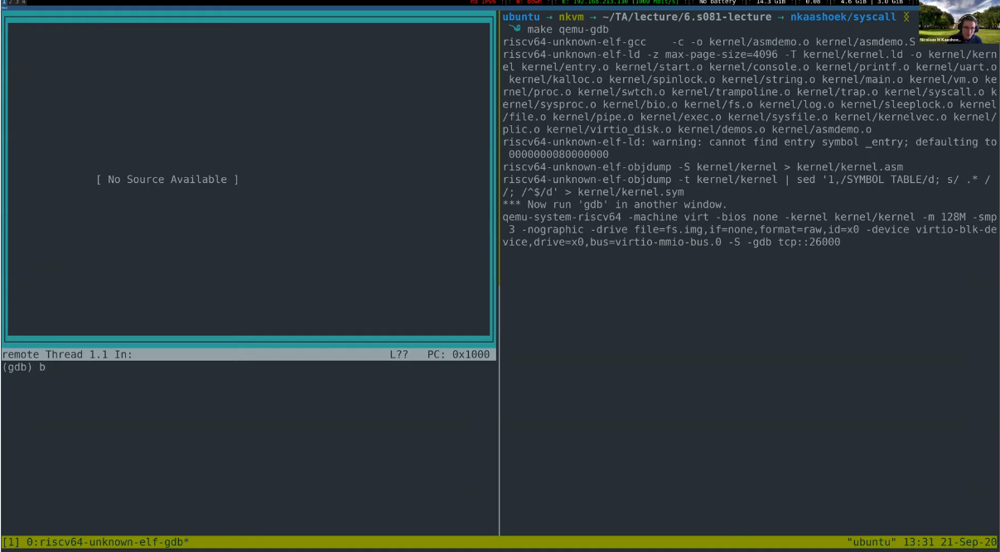
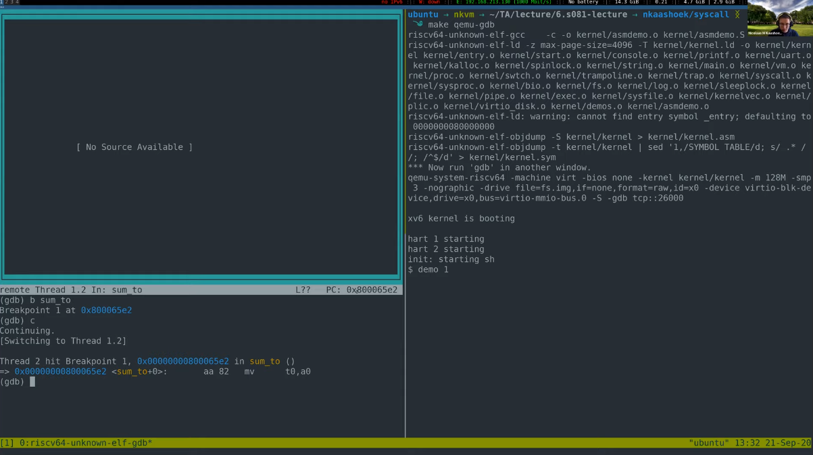
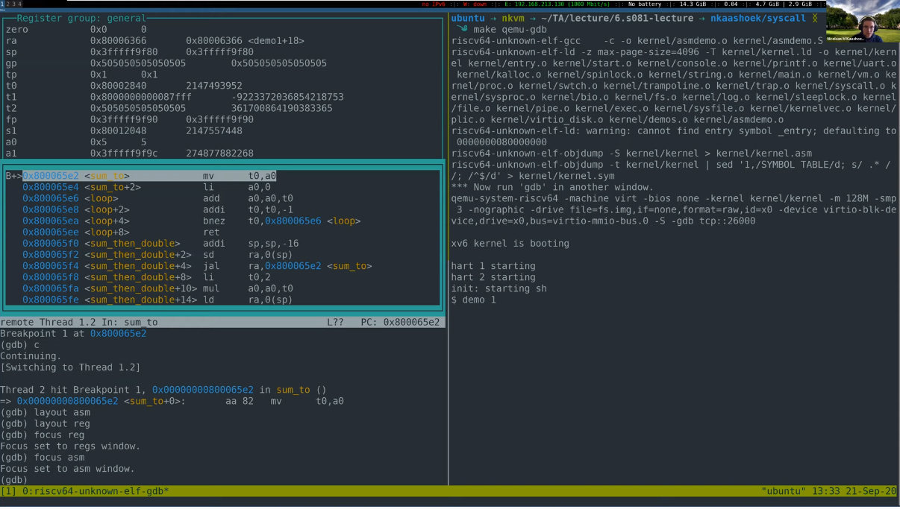
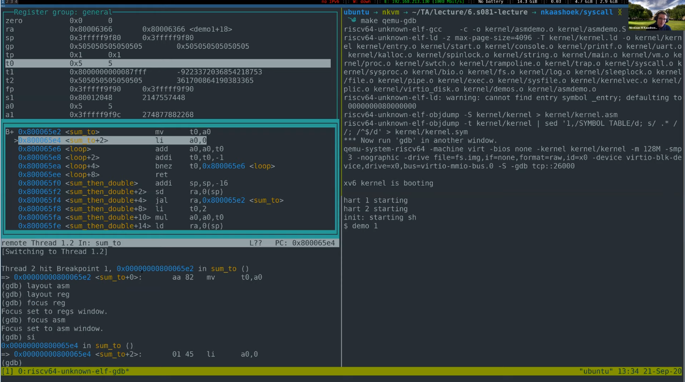
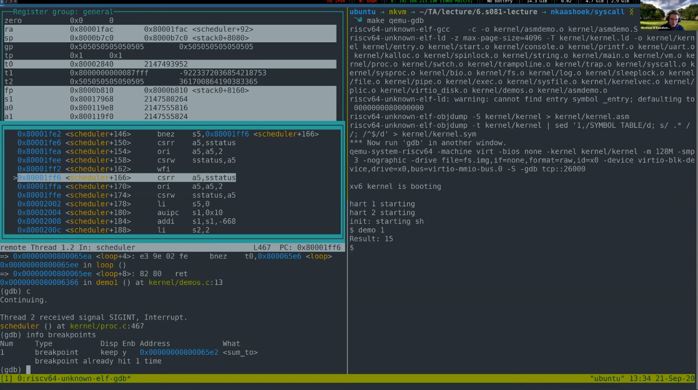
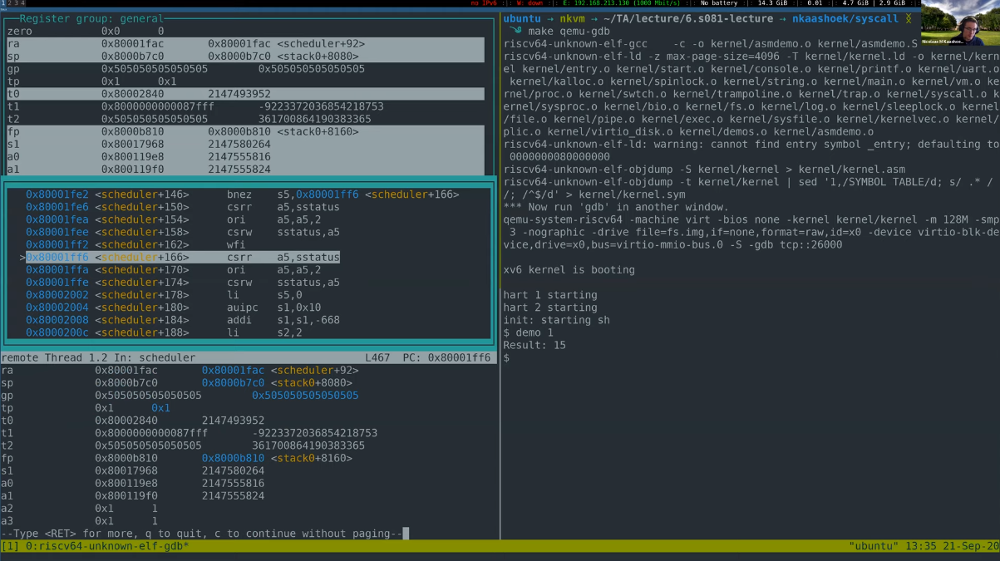

# 5.4 汇编代码和GDB 

既然我们已经聊了一会儿汇编，我想让你们看一看具体的汇编代码。

上半部分有一段C代码，这个具有累加器的简单函数从0循环到n，计算0到n的累加值并返回结果。下半部分则是你们编译这段程序能得到的最简单的汇编代码。如果你在自己的电脑上写了这段代码并编译出来，你会得到由于种种原因而看上去与这个汇编代码截然不同的汇编代码，其中一部分源于我们自己的代码，一部分则是由编译器决定，现代编译器在将你的C代码编译成汇编时会进行大量的优化，所以你的汇编指令可能看起来截然不同。例如当你在gdb中debug时，你可能碰巧发现一些变量被优化掉了，这表明编译器认为不需要那些变量，去除它们将使程序运行变得高效。而图中的汇编代码就是最直截了当的形式，我们把a0中的值移动到t0中，然后把a0中的值设为0，然后我们在循环的每一次迭代中都把t0的值加到a0上，直到t0的值为0。

>学生提问：我想知道.section，.text，.global都代表什么？
>
>老师：我们来看看def.h文件，如果你预习过了，你应该会对这个文件很熟悉，它基本上包含了内核中所有你会用到的函数的声明，.global表明你可以在其他代码文件中调用这个函数。
>
>老师：.text表明这是一段代码，你可以回想一下书中的图3.4，我们来看一下，在这个表中，这个text和你问的是同一个东西，它们都表示代码段。
>
>

如果你对内核到底长啥样很感兴趣，你可以去看一下kernel.asm，这里有xv6内核的完整汇编代码，左边的这些数字都是标明指令在内存中的地址的标签，十分方便，这里的非数字标签则是函数声明的位置，这些汇编代码在我们debug的时候会很有用，希望过一会儿我演示的时候会用上它们。

> 学生提问：.s文件和.asm文件的区别是什么？
>
> 老师：我的理解不一定是百分百正确的，我认为.asm文件包含了一系列的额外注释而.s文件则没有，所以通常你将C代码编译到.s文件时得到的文件不包含这些注释所在的行。如果你很好奇该如何得到.asm文件，去看看Makefile，那里面有确切的步骤。

继续聊这个sum_to函数，我们来看看怎么在gdb中测试它。现在我们的终端里有两个窗口，首先当然是运行qemu，我们可以用gdb模式运行qemu（`make qemu-gdb`）,现在它停在了这里。然后我们可以运行gdb了（`riscv64-unknown-elf-gdb`）。

如果你键入`tui enable`，你会得到这个窗口，它现在是空的，但待会儿debug的时候会很有用。

这些代码都是内核中的而非用户空间的，所以我们设断点时不会有令人糟心的问题，我们可以在函数sum_to设一个断点(`b sum_to`)，然后继续运行(`c`)，运行那个函数(`demo 1`)。

第一个窗口是源代码窗口，正如David所说，kernel.asm左边的这些数字在调试时非常有用，你可以通过这些数字得到地址。我们可以在gdb窗口右上角看到“PC：0x800065e2”，我们在kernel.asm里搜索这个特定的地址，我们可以发现这正是sum_to函数的起始地址。所以当你看到这些地址时，你可以直接到kernel.asm里寻找问题出现的具体行，或者依此设置断点。

如果我们想在tui窗口中看汇编代码，我们可以键入`layout asm`，然后tui窗口中就会显示所有的汇编指令，我们也可以键入`layout reg`来查看寄存器的内容，如果你想滚动查看这三个窗口中某一个的内容，你可以指定聚焦其中之一，比如想滚动浏览寄存器窗口，键入`focus reg`就可以聚焦到寄存器窗口了，此时使用方向键或者滚动鼠标就可以滚动浏览该窗口，现在我们再键入`focus asm`就可以聚焦到源代码窗口了。我们来看看寄存器窗口，t0包含的值为0x80002840，a0包含的值为0x5。

我们单步执行汇编程序（`si`），可以看到t0得到了a0的值0x5，并且寄存器t0变化为高亮了。

我们按enter键可以执行上一次执行的指令，这样我们就可以不断的单步执行，现在我们把a0的值设为0了，现在我们就看着这个循环不断的累加值。这只是一个玩具函数，我们直接使用continue吧。如果你想知道你设置过哪些断点，或者说你忘了你正在做什么，你可以键入`info breakpoints`来查看设置过的所有断点，你甚至可以看到这个断点已经触发过1次，此外还有许多有用的信息。

如果你不想用寄存器窗口，你可以键入`info reg`或者`info registers`或者`ireg`或者其他的很多gdb简写来查看寄存器内容。

关于gdb调试的内容我就不再赘述了，你们可以去Google查找更多的gdb指令。

