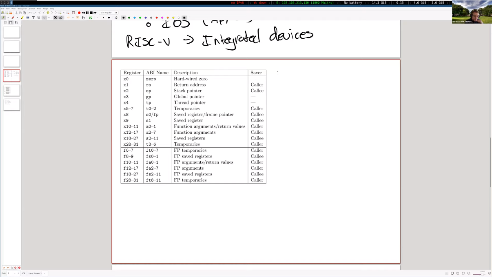
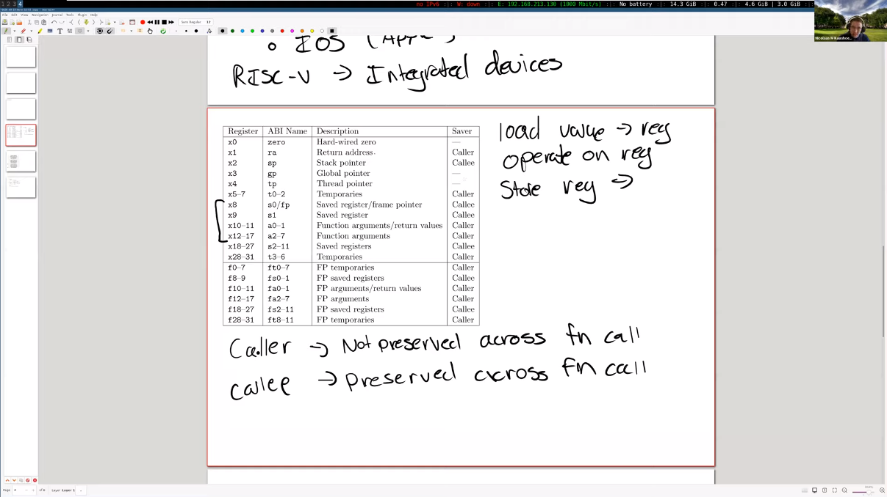

# 5.5 寄存器

现在我们要越过刚刚讲的一系列知识，深入地探讨一些细节，这一次的实验需要你们事先掌握这些细节，而且这也是一定程度上对之前课程的回顾。

你们已经学过课程6.004了，所以一定对这个寄存器表格很熟悉。

寄存器是CPU中预设用来储存数值的工具。它是不可或缺的，因为汇编指令无法直接在内存之间操作，所以写汇编时我们经常会用到将数值从寄存器或内存中载入另一个寄存器的操作，然后在寄存器上再执行一系列计算，如果算出的结果很重要，我们又会把寄存器的值存入某个内存地址，我们的代码大体上都是按这一系列操作来执行的，寄存器是执行任何运算操作以及取值操作时最快速的媒介，因此，如果某个操作只用寄存器就能完成，那就不要用内存，不然会影响到执行速度。

我们通常使用寄存器的ABI Name来指代某个寄存器，因为这样不仅不容易混淆用途，而且符合标准，符合你写在汇编代码中的形式。这些命名中的数字并没有重要的含义，只有在压缩版的RISC-V中才会用到这些数字以区分寄存器是否可用，正常的RISC-V指令是64位的，但也有压缩版的16位指令，在压缩版中我们能用到的寄存器比较少，只有8-15号寄存器是可用的。可能有人会问为什么s1和s2-s11寄存器是分开的，我想大概就是因为s1可以在压缩版中使用而s2-s11不行。a0-a7是用来存储函数参数的，但如果我们的函数参数超过8个，那我们就不得不用内存来存储多余的参数了。

最后一列是Saver信息，当我们讨论寄存是调用者保存还是被调用者保存时，这一列的信息就非常重要了。这两种类型很容易被混淆，调用者保存寄存器（caller saved registers）的内容不会被调用的函数保存，被调用者保存寄存器（callee saved registers）的内容会被调用的函数保存，这意味着调用者保存寄存器（caller saved registers）的内容可以被函数随意覆写。

